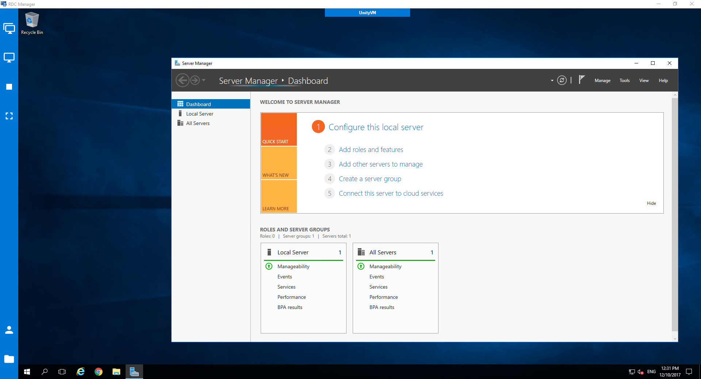

# RDC Manager

Save, manage and access all your rdc connections from one window

## Requirements

 * Windows 10 / 8 / 7
 * Visual Studio 2017 / 2015
 * .NET Framework 4.6.1

## Built with

 * C#
 * Wpf
 * [Material Design In XAML Toolkit](https://github.com/ButchersBoy/MaterialDesignInXamlToolkit) for the ui style
 
## Screenshots

